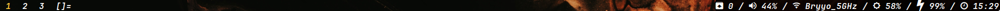

# evadere-bar

The status bar for [`evadere-dotfiles`](https://github.com/doczi-dominik/evadere-dotfiles). Fork of [`gocaudices`](https://github.com/LordRusk/gocaudices) with some custom scripts and config:

- Custom color and font config
- Time
- Brightness
- Battery script
- Network script that shows IP for Ethernet, SSID for Wifi and shows if wlan card is blocked
- Pulseaudio volume script with muted icon
- Show number of pacman and AUR package updates using `checkupdates+aur`

